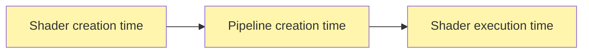

There are three key phases in a shader's lifetime (shown in context <a href="#in-context">below</a>):



Each phase finalizes the value for expressions in a certain category, as follows:

## Evaluation Phase
### Shader creation
* Finalizes values for `const-expressions`
* Sub-expressions can be:
  * literals,
  * `@const` function calls,
  * const-declared values

### Pipeline creation
* Finalizes values for `override-expressions`
* Sub-expressions can be anything in a `const-expression`, plus
  * override-declared values,
  * values from [GPUProgrammableStage.constants](https://gpuweb.github.io/gpuweb/#dom-gpuprogrammablestage-constants)

### Shader execution
* Finalizes values for `runtime-expressions`
* Sub-expressions can be anything in a `override-expression`, plus
  * let-declared values
  * any function call,
  * variable contents
  * reference or pointer to a variable


## In Context
<figure>

The shader phases fit into a WebGPU application as follows:

```mermaid
sequenceDiagram
  participant A as App
  participant C as Browser
  note over A,C: Get a GPUAdapter, GPUDevice
  A ->>+C: device.createShaderModule(...)
  activate C
  Note right of C: Shader-creation time
  C -->> A: a GPUShaderModule
  deactivate C
  A ->>C: device.createComputePipeline(...)<br/>or device.createRenderPipeline(...)<br>Provides GPUProgrammablestage.constants
  activate C
  Note right of C: Pipeline-creation time
  C -->> A: a GPUComputePipeline<br/>or GPURenderPipeline
  deactivate C
  Note over A,C: Create and bind resources,<br>Record GPU commands ...
  %%Note over A,C: Submit commands
  A ->>C: device.queue.submit(...)
  C-->>C: Wait to be scheduled
  activate C
  Note right of C: Shader execution
  A ->> C: device.queue.onSubmittedWorkDone()
  C -->> A: a pending Promise&lt;undefined&gt;
  C -->> A: fulfill Promise
  deactivate C
```

</figure>
